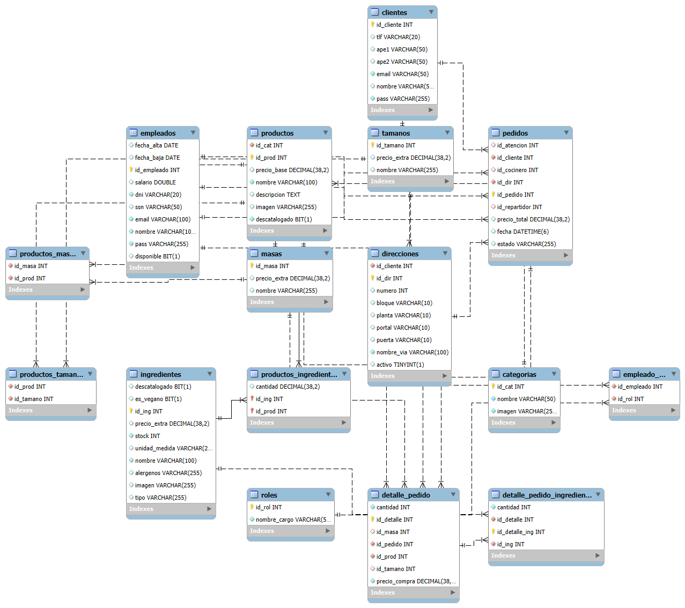
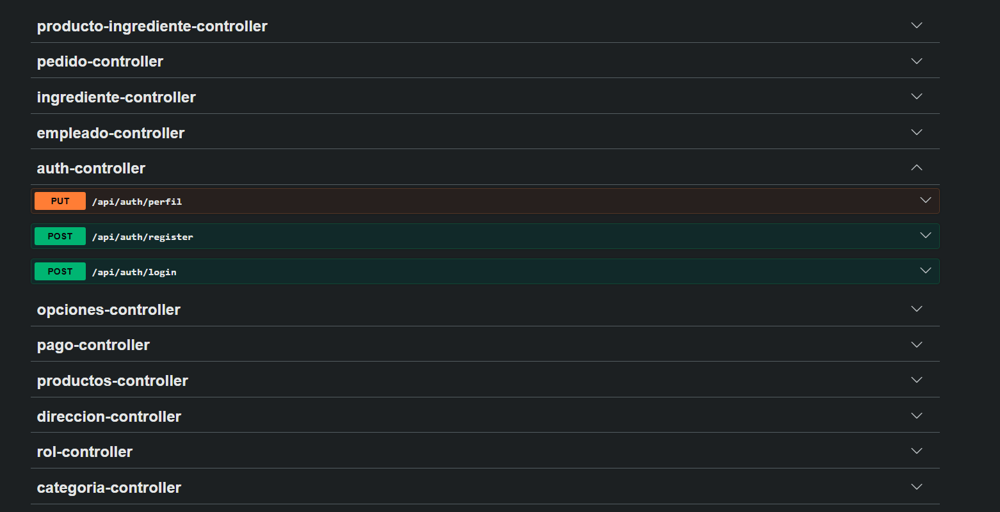
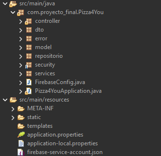

# Pizza4You Backend

Backend for Pizza4You, a pizza ordering system connecting an Angular web application and an Android mobile application.

> Built as a final project for 2nd year DAM (Cross-platform Application Development).

## Preview

 Database Entity-Relation diagram: 
  

 API documentation (Swagger UI): 
  

 Project structure overview: 
  

## ✨ Features

- **Authentication & Authorization:** JWT-based login for clients and employees, with role-based access control (Cocinero, Repartidor, Atencion, Cliente).
- **Product Catalog:** Full CRUD for products with image upload, category filtering, featured products ranking, and soft-delete (descatalogar).
- **Ingredient Management:** CRUD for ingredients with stock tracking, unit of measure, vegan/allergen flags, and extra pricing.
- **Pizza Customization:** Define available sizes (Tamaño) and dough types (Masa) per product, each with optional extra pricing.
- **Order Management:** Full order lifecycle (RECIBIDO → PREPARANDO → ENCAMINO → ENTREGADO) with automatic employee assignment for kitchen and delivery.
- **Stock Control:** Validates ingredient availability before order creation and automatically deducts stock on purchase.
- **Stripe Payments:** PaymentIntent creation with manual capture, integrated into the order flow.
- **Push Notifications:** Firebase Cloud Messaging for real-time order status updates (optional).
- **Employee Management:** CRUD with availability toggling, role filtering, and automatic assignment to active orders.
- **Address Management:** Clients can store multiple delivery addresses with soft-delete support.
- **API Documentation:** Interactive Swagger UI available at `/swagger-ui.html`.

## 📌 TODO
- Fix typos and "Spanglish"
- Clean up commented-out code (low stock alerts, employee order endpoints).
- Implement proper input validation across all controllers.
- Review of status change from employees.
- Lack of PreAuthorize in some methods.
- Include 'Admin' role.

## 🚀 How to deploy

1. **Clone the repository**

   ```bash
   git clone https://github.com/yourusername/Pizza4You.git
   cd Pizza4You
   ```

2. **Set up the database**

   Import the included dump (schema + seed data):

   ```bash
   mysql -u root -p -e "CREATE DATABASE IF NOT EXISTS proyecto_final;"
   mysql -u root -p proyecto_final < database/proyecto_final.sql
   ```

3. **Configure environment variables**

   Copy the template and fill in your values:

   ```bash
   cp .env.example .env
   ```

   | Variable | Required | Description |
   |----------|----------|-------------|
   | `DB_URL` | Yes | MySQL JDBC URL (e.g. `jdbc:mysql://localhost:3306/proyecto_final`) |
   | `DB_USERNAME` | Yes | Database username |
   | `DB_PASSWORD` | Yes | Database password |
   | `JWT_SECRET` | Yes | Secret key for JWT tokens (min 32 characters) |
   | `STRIPE_API_KEY` | Yes | Stripe API key (test or live) |
   | `FIREBASE_SA_PATH` | No | Path to Firebase service account JSON |

4. **Run the application**

   ```bash
   ./mvnw spring-boot:run
   ```

   Or with the local profile (uses `application-local.properties`):

   ```bash
   ./mvnw spring-boot:run -Dspring-boot.run.profiles=local
   ```

5. **Access the API docs**

   Open Swagger UI at: [http://localhost:8080/swagger-ui.html](http://localhost:8080/swagger-ui.html)

## Tech Stack

| Technology | Purpose |
|------------|---------|
| Java 21 | Runtime |
| Spring Boot 4.0.2 | Framework |
| Spring Security | Authentication & authorization |
| Spring Data JPA | Database access |
| MySQL 8.0+ | Database |
| Stripe Java SDK | Payment processing |
| Firebase Admin SDK | Push notifications |
| SpringDoc OpenAPI | API documentation |
| Lombok | Boilerplate reduction |
| Maven | Build tool |

## Project Structure

```
Pizza4You/
├── database/
│   └── proyecto_final.sql          # Full database dump (schema + data)
├── imagenes_externas/              # Uploaded images (runtime)
├── src/main/java/.../
│   ├── controller/                 # REST API controllers (11)
│   ├── model/                      # JPA entities (15)
│   ├── services/                   # Business logic (14)
│   ├── repositorio/                # Data access (14)
│   ├── dto/                        # Data transfer objects (22)
│   ├── security/                   # JWT & Spring Security (4)
│   └── error/                      # Global error handling (4)
└── src/main/resources/
    ├── application.properties      # Config (env var placeholders)
    └── firebase-service-account.json  # Firebase credentials (gitignored)
```

## API Endpoints

### Authentication

| Method | Endpoint | Auth | Description |
|--------|----------|------|-------------|
| POST | `/api/auth/login` | Public | Login (client or employee) |
| POST | `/api/auth/register` | Public | Register new client |
| PUT | `/api/auth/perfil` | Authenticated | Update client profile |

### Products

| Method | Endpoint | Auth | Description |
|--------|----------|------|-------------|
| GET | `/api/productos` | Public | List all products |
| GET | `/api/productos/{id}` | Public | Get product by ID |
| GET | `/api/productos/categoria/{id}` | Public | Products by category |
| GET | `/api/productos/destacados` | Public | Top 3 products of the month |
| POST | `/api/productos/crear` | Authenticated | Create product |
| PATCH | `/api/productos/{id}` | Authenticated | Update product |
| DELETE | `/api/productos/{id}` | Authenticated | Delete product |
| PATCH | `/api/productos/descatalogar` | Authenticated | Soft-delete product |
| POST | `/api/productos/{id}/opciones` | Staff | Assign sizes & dough to product |

### Ingredients

| Method | Endpoint | Auth | Description |
|--------|----------|------|-------------|
| GET | `/api/ingredientes/disponibles` | Public | List available ingredients |
| GET | `/api/ingredientes` | Authenticated | List all ingredients |
| GET | `/api/ingredientes/{id}` | Authenticated | Get ingredient by ID |
| POST | `/api/ingredientes` | Authenticated | Create ingredient |
| PUT | `/api/ingredientes/{id}` | Authenticated | Update ingredient |
| PATCH | `/api/ingredientes/descatalogar` | Authenticated | Toggle discontinued flag |

### Orders

| Method | Endpoint | Auth | Description |
|--------|----------|------|-------------|
| POST | `/api/pedidos` | Authenticated | Create order (with payment) |
| POST | `/api/pedidos/local` | Staff | Create in-store order |
| GET | `/api/pedidos` | Authenticated | List all orders (paginated) |
| GET | `/api/pedidos/{id}` | Authenticated | Get order by ID |
| GET | `/api/pedidos/{id}/detalles` | Authenticated | Get order with line items |
| GET | `/api/pedidos/{id}/domicilio` | Authenticated | Get delivery address |
| GET | `/api/pedidos/usuario/{id}` | Authenticated | Orders by client |
| GET | `/api/pedidos/activos` | Authenticated | Active orders |
| GET | `/api/pedidos/historial` | Authenticated | Completed/cancelled orders |
| PUT | `/api/pedidos/{id}/estado` | Staff | Update order status |

### Employees

| Method | Endpoint | Auth | Description |
|--------|----------|------|-------------|
| GET | `/api/empleados` | Authenticated | List all employees |
| GET | `/api/empleados/disponibles` | Authenticated | List available employees |
| GET | `/api/empleados/{id}` | Authenticated | Get employee by ID |
| GET | `/api/empleados/rol/{rol}` | Authenticated | Employees by role |
| POST | `/api/empleados` | Authenticated | Create employee |
| PATCH | `/api/empleados/{id}` | Authenticated | Update employee |
| DELETE | `/api/empleados/{id}` | Authenticated | Delete employee |
| PUT | `/api/empleados/{id}/disponible` | Authenticated | Toggle availability |

### Addresses

| Method | Endpoint | Auth | Description |
|--------|----------|------|-------------|
| GET | `/api/direcciones` | Authenticated | Get client addresses |
| POST | `/api/direcciones` | Authenticated | Add address |
| DELETE | `/api/direcciones/{id}` | Authenticated | Soft-delete address |

### Other

| Method | Endpoint | Auth | Description |
|--------|----------|------|-------------|
| GET | `/api/categorias` | Public | List all categories |
| GET | `/tamanos` | Public | List all sizes |
| GET | `/masas` | Public | List all dough types |
| GET | `/api/productos-ing/{id}` | Authenticated | Ingredients for a product |
| POST | `/api/productos-ing/{idProducto}` | Authenticated | Add ingredient to product |
| PUT | `/api/productos-ing/{idProducto}` | Authenticated | Update ingredient quantity |
| DELETE | `/api/productos-ing/{idProducto}/{idIngrediente}` | Authenticated | Remove ingredient from product |
| POST | `/pagos/crear-intent` | Authenticated | Create Stripe PaymentIntent |
| GET | `/api/roles` | Authenticated | List all roles |